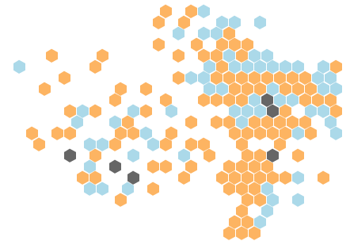

# EqualAreaCartogram
A Python script that converts a Shapefile, GeoJSON, or CSV to an equal area cartogram SVG

### TL;DR
Convert Choropleths to Equal Area Hex Gridmaps.

_Dense hexmap_

_Sparse hexmap_

Look at [this notebook] (https://) for seeing how this can be used.

### Motivation
Choropleths fail to adequately highlight geographically small areas. This becomes particularly pertinent when covering elections, where each constituency has the same weight regardless of its geographical size. Equal area cartograms solve this problem, and have been used fairly effectively by a number of news organizations - as shown in the image below (taken from [Richard Brath's excellent blog] (https://richardbrath.wordpress.com/2015/10/15/equal-area-cartograms-and-multivariate-labels/))

However, making equal area cartograms can be a time consuming process - particularly for relatively obscure regions where well-designed SVGs of equal area cartograms are not easily available. While there is an excellent [R implementation] (https://github.com/sassalley/hexmapr) for producing these, I could not find a Python implementation. Moreover, the R implementation above creates a contiguous map. This is advantageous for some situations, but can completely destroy resemblance to the real geography of an area for others.

### Algorithm
1. Get the x_coord (latitude) and y_coord (longitude) of each area 
2. Normalize the x_coords and y_coords to align all points into a rectangular grid with a length that width that you define. This will create a matrix that is something like the image below

3. If a bin (i.e., an x-y coordinate pair) has more than 1 point, select a point from the bin and shunt it to a neighbouring bin if neighbouring bin is empty. If no neighbouring bin is empty find a direction (up, down, left, or right) with the most proportion of empty spaces, shift all existing points in that direction by 1, and then move the selected point into that direction

4. Iterate 3. until all bins only have 1 point in them. This will lead to a matrix that is something like the image below

5. Convert the matrix obtained from point 4 into an SVG with hexagon polygons

